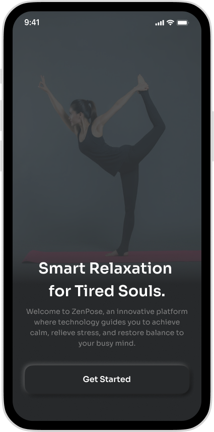

# Yoga Pose Detection App

Aplikasi Deteksi Gerakan Yoga untuk Relaksasi dan Meditasi berbasis Computer Vision.

## 📱 Deskripsi

Aplikasi ini membantu pengguna melakukan gerakan yoga relaksasi dengan benar di rumah. Menggunakan teknologi **Computer Vision**, aplikasi memberikan feedback otomatis atas pose tubuh pengguna, sehingga latihan menjadi lebih efektif dan bermanfaat untuk kesehatan mental.

## ✨ Fitur Utama

- Deteksi pose yoga secara real-time menggunakan kamera ponsel
- Panduan langkah demi langkah untuk berbagai pose yoga
- Informasi manfaat dari setiap gerakan yoga
- Rekam progress dan sesi latihan pengguna
- Desain antarmuka yang ramah dan intuitif

## 📸 Tampilan Aplikasi


## 🚀 Instalasi

Jalankan perintah berikut di terminal:

```bash
git clone https://github.com/Asgardiansss/MobileApp.git
cd MobileApp
flutter pub get
flutter run
